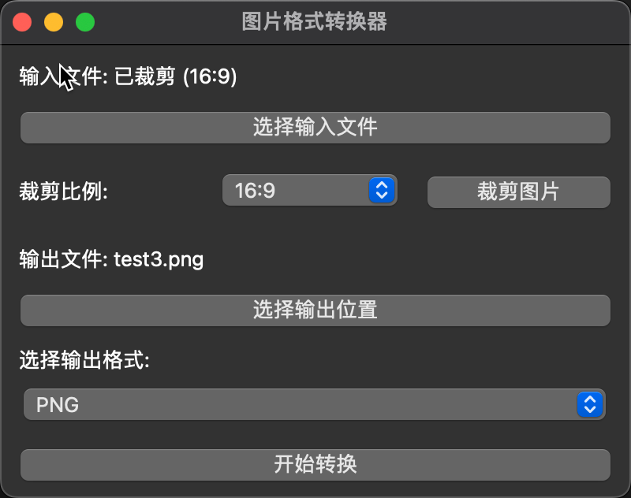

### 基于PyQt构建简单的GUI界面用于转换图像格式


```sh
安装依赖
pip install PyQt6

pip install pillow
```

### 预览

## 许可证

本项目采用 MIT 许可证。这意味着你可以：
- ✅ 自由使用
- ✅ 自由复制
- ✅ 自由修改
- ✅ 自由分发

但需要：
- ⚠️ 保留原作者版权声明
- ⚠️ 仅供学习使用，不承担任何责任

详细信息请查看 [LICENSE](LICENSE) 文件。